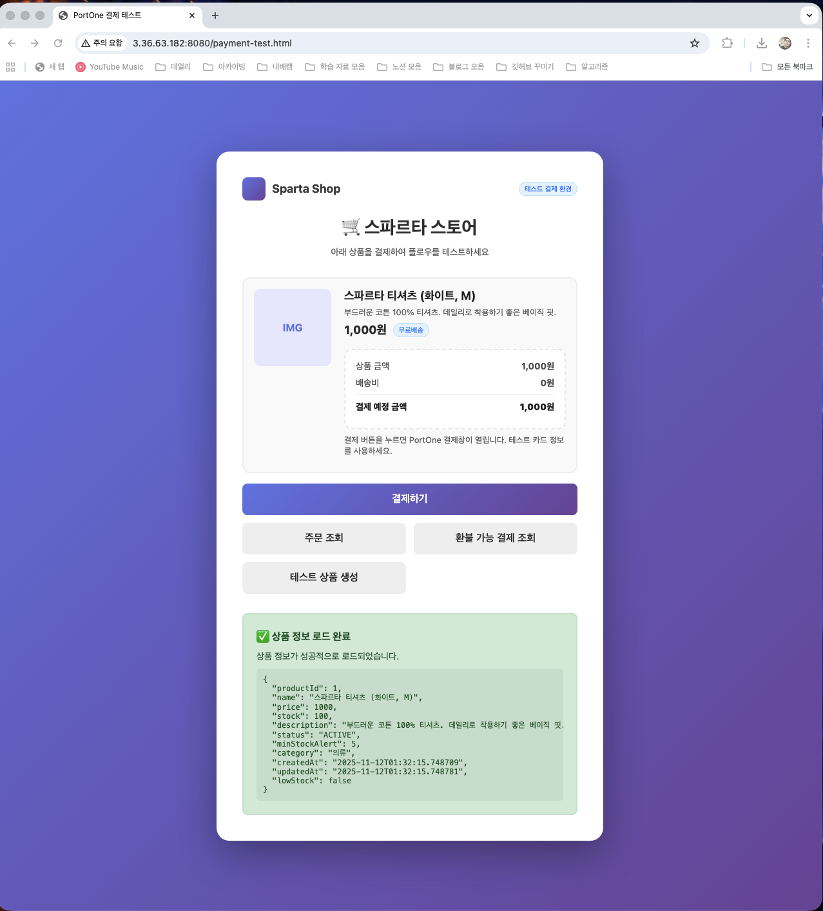

# ☁️ 클라우드 기반 아키텍처 설계 - 아키택처 설계 & 배포

>**과제 목표**
> - 운영체제, 네트워크 개념을 익힌다.
> - 클라우드 아키텍처를 이해하고 서비스 확장성을 고려한 설계를 수행한다.
> - 수동 배포와 자동 배포 방식을 비교·체험하여 운영 효율성을 학습한다.
> - CI/CD 파이프라인과 헬스체크를 통해 서비스 품질 관리 및 자동화 개념을 이해한다.

---

## 필수 기능 가이드

### 1. 네트워크 & 운영체제 개념
> 목적
> - 운영체제와 네트워크의 핵심 개념을 이해하여, 백엔드 서버 개발 시 **프로세스 관리·동기화 제어·네트워크 통신 구조**를 논리적으로 설명하고 적용할 수 있는 기초 역량을 기른다.

: 학습봇 활용한 파일 제출 완료

### 2. CI/CD 파이프라인 다이어그램 그리기

### 3. 수동 배포
> 목적
> - 기본적인 배포 과정을 체험한다.

### ✅ 배포 결과 확인 (웹 접속 화면)
수동배포 완료 이후, 서버 실행 명령어 없이 Spring Boot 서비스가 잘 작동하는 화면 

